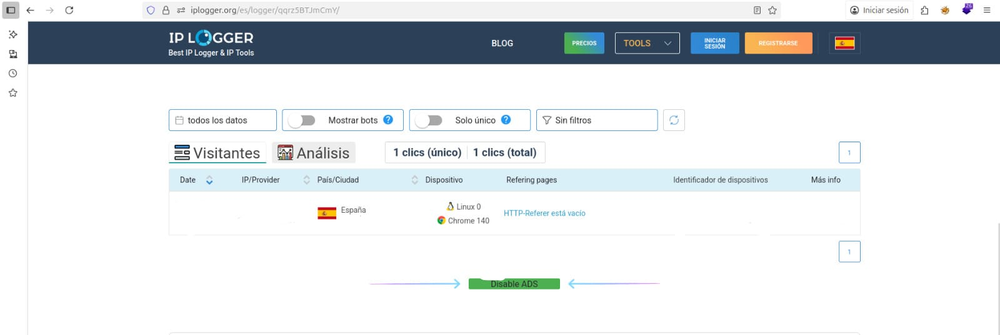
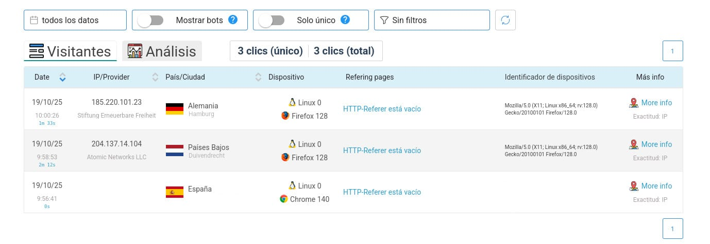

# 2️⃣ 🌍 Cómo obtienen tu IP

Laboratorio educativo en entorno controlado: se usa mi propia IP, correctamente ocultada en las capturas.  
Objetivo: entender cómo se filtra una IP al visitar ciertos enlaces.

## 🧪 Demostración con IPLogger (uso ético)

IPLogger permite crear enlaces que registran la IP del visitante antes de redirigir a una página legítima.

## 📸 Capturas del laboratorio — Sección 2

⚠️ **Advertencia ética:**  
Nunca uses IPLogger ni técnicas similares para obtener información de terceros sin consentimiento. Este ejemplo se realiza solo en un entorno controlado y con fines educativos.
