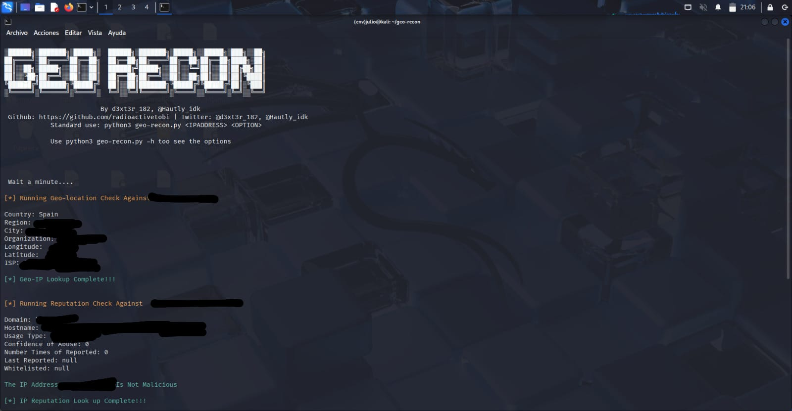

# 3️⃣ 🧩 Técnicas OSINT — Ejemplo con geo-recon

> OSINT (Open Source INTelligence) es la recopilación de información pública disponible en Internet.  
> Aquí se muestra cómo usar la herramienta **geo-recon** para analizar una IP propia y entender su potencial.

---

## 🛠️ Instalación de geo-recon

```bash
sudo apt update
sudo apt install -y git python3 python3-pip
git clone https://github.com/thewhiteh4t/geo-recon.git
cd geo-recon
pip install -r requirements.txt
⚖️ Uso ético y legal

Estas técnicas deben emplearse solo en entornos propios o con permiso explícito; su finalidad es educativa.

<p align="center">
  
  <br>
  <em>Figura 12 — Nueva captura 1.1 (detalle adicional del laboratorio)</em>
</p>

<p align="center">
  
  <br>
  <em>Figura 13 — Nueva captura 2.1 (detalle adicional del laboratorio)</em>
</p>


Figura 12 — Nueva captura 1.1 (detalle adicional del laboratorio)


Figura 13 — Nueva captura 2.1 (detalle adicional del laboratorio)
