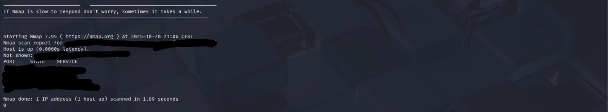

# 3️⃣ 🧩 Técnicas OSINT — Ejemplo con geo-recon

> OSINT (Open Source INTelligence) es la recopilación de información pública disponible en Internet.  
> Aquí se muestra cómo usar la herramienta **geo-recon** para analizar una IP propia y entender su potencial.

---

## 🛠️ Instalación de geo-recon

```bash
sudo apt update
sudo apt install -y git python3 python3-pip
git clone https://github.com/thewhiteh4t/geo-recon.git
cd geo-recon
pip install -r requirements.txt
```

---

## 📸 Capturas del laboratorio — Sección 3

  
Figura 9 — Ejecución de geo-recon con opción -n (puertos abiertos)

  
Figura 10 — Datos públicos recogidos por geo-recon (IP anonimizada)

  
Figura 11 — IP mostrada por geo-recon al analizar la IP de salida de Tor

  
Figura 12 — Nueva captura 1.1 (detalle adicional del laboratorio)

  
Figura 13 — Nueva captura 2.1 (detalle adicional del laboratorio)

---

## ⚖️ Uso ético y legal

Estas técnicas deben emplearse solo en entornos propios o con permiso explícito; su finalidad es educativa.
